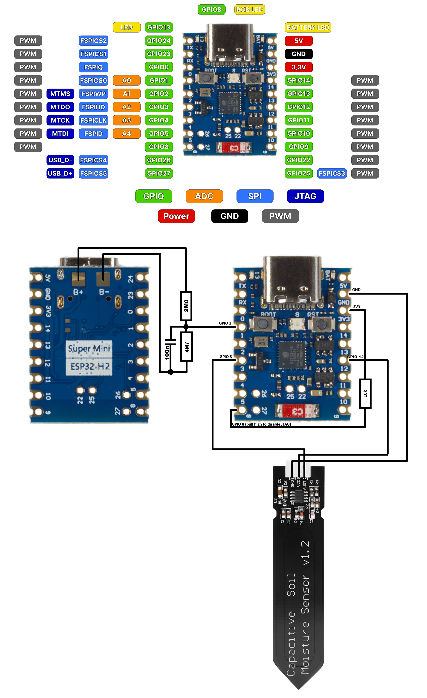
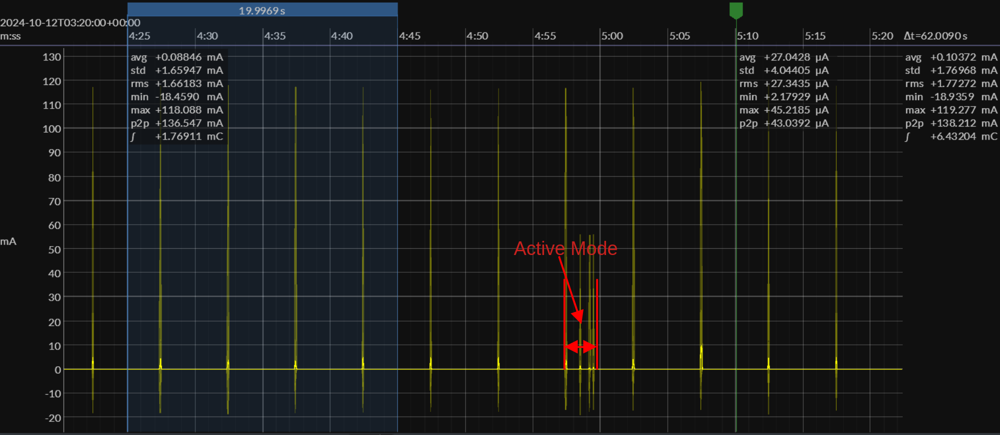
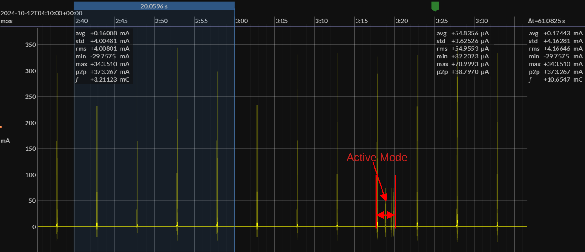
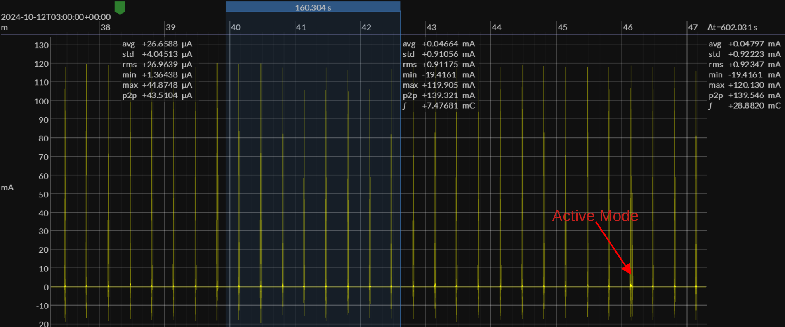
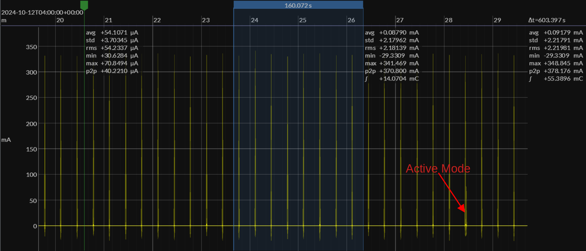

# Bodenfeuchtigkeitssensor mit ESP32H2 als LIT Device
Bodenfeuchtigkeitssensor, alle 10min wird der Wert übermittelt, Rest Light Sleep (30uA)

## ESP-IDF aktivieren (+Matter Pfad setzen)

```bash
source ~/esp-idf/export.sh
source ~/esp-matter/export.sh
```

## Device setzen (ESP32H2 als LIT Device ("Long Idle Time"))

```bash
idf.py -D SDKCONFIG_DEFAULTS="sdkconfig.defaults.esp32h2.lit" set-target esp32h2
```

## Factory Partition auf 0x10000 flashen

```bash
esptool.py --chip esp32h2 --port /dev/ttyACM0 --baud 460800 write_flash 0x10000 "out/fff2_8001/407bf0e4-99aa-4545-a8c4-aeb171f4edf5/407bf0e4-99aa-4545-a8c4-aeb171f4edf5-partition.bin"
```

## Rest flashen (Bootloader, Partition Table, App, OTA_data)

```bash
idf.py -p /dev/ttyACM0 flash
```

oder mit Monitor:

```bash
idf.py -p /dev/ttyACM0 flash monitor
```


## Voraussetzung: Einstellungen in menuconfig für Factory Partition

Folgende Settings in `menuconfig` setzen (`idf.py menuconfig`):

- **Component config → CHIP Device Layer → Commissioning options**
  - Use ESP32 Factory Data Provider
  - Use ESP32 Device Instance Info Provider
- **Component config → ESP Matter → Device Instance Info Provider options**
  - Device Instance Info - Factory
- **Component config → ESP Matter → DAC Provider options**
  - Attestation - Factory

## Matter QR Code

Der Matter QR Code steht in der Datei  
`\out\fff2_8001\<...>_codes.csv`  
oder direkt als PNG-Datei im selben Ordner.

Matter QR Code Generator auch unter:  
[https://thekuwayama.github.io/matter_qrcode_generator/](https://thekuwayama.github.io/matter_qrcode_generator/)

## Matter Informationen

Matter Informationen wurden über das Skript  
`\scripts\generate_factory_partition.sh`  
erstellt (mit esp-matter-mfg-tool). Informationen können hier einfach angepasst werden.
Das Skript flasht jetzt automatisch am Ende (auf Nachfrage)

## USB zu WSL durchschleifen mit usbipd

```bash
usbipd list
usbipd attach -a --wsl --busid <busid>
# vorher mit als admin gestartetem cmd Fenster:
usbipd bind --busid <busid>
```

## Verdrahtungsplan




## Optimierungen Ruhestrom
-RGB LED heruntergelötet (WSxxx)
-3V3 Wandler ersetzt durch ADP162AUJZ-3.3-R7 (spart 80uA)
-GPIO 8 auf high (JTAG deaktiviert)
-NE555 durch ICM7555 (Nanoamperebereich statt 8mA)
-Akkumessung sehr hochohmig (2+4.7 Megaohm, nur 0.6uA)

-gesamt etwa 30uA im Light Sleep, gemessen in der Akkuzuleitung.

## Matter-OTA-Auto-Sync auf Home Assistant einrichten
Voraussetzungen:
HA mit Advanced SSH & Web Terminal-Add-on (Protection Mode = OFF),
Matter-Server-Add-on läuft (Container: addon_core_matter_server),
icd_app.ota und icd_app.json als Assets eines GitHub-Releases hochgeladen (öffentliches Repo)  

**1. Sync-Skript anlegen**  

Im SSH-Add-on-Terminal:

```bash
nano /config/sync_matter_ota.sh
```
Inhalt einfügen (scripts/ha/sync_matter_ota.sh).
Speichern (Strg+X, y), ausführbar machen:
```bash
chmod +x /config/sync_matter_ota.sh
```
**2. Einmal manuell testen**
```bash
bash /config/sync_matter_ota.sh once
cat /config/matter_ota.log
```
Erwartet: change detected ... copied ... addon ready. Gegencheck:

```bash
docker exec addon_core_matter_server cat /config/ota/icd_app.json
```

**3. Daemon-Starter anlegen**
```bash
nano /config/start_matter_sync.sh
```

```sh
#!/bin/sh
pkill -f sync_matter_ota.sh
nohup /config/sync_matter_ota.sh daemon >/dev/null 2>&1 &
```

```bash
chmod +x /config/start_matter_sync.sh
```

**4. Beim Add-on-Start automatisch starten**
HA → Einstellungen → Add-ons → Advanced SSH & Web Terminal → Configuration → bei init_commands einen Eintrag hinzufügen:
```bash
/config/start_matter_sync.sh
```
Speichern → Add-on Restart.

**5. Prüfen**
```bash
ps aux | grep sync_matter_ota   # eine Zeile mit "daemon"
tail -f /config/matter_ota.log  # zeigt "daemon start ..." + Sync-Läufe
```

**6. Matter-Server App Konfiguration**

Unter "Konfiguration" ein "Extra Matter Server argument" angeben:
```bash
--ota-provider-dir /config/ota
```


Um den Update Suchvorgang anzustoßen, unter Einstellungen->System->Updates den Refresh Button klicken.  
Das Skript startet den Matter-Server neu, falls eine neue Datei kopiert wurde.

# BASISPROJEKT: ICD_APP Example (Intermittently Connected Device)

This example creates a Matter ICD device using the ESP Matter data model. Currently it is available for ESP32-H2 and ESP32-C6.

See the [docs](https://docs.espressif.com/projects/esp-matter/en/latest/esp32/developing.html) for more information about building and flashing the firmware.

**Note**: Please use IDF v5.2.2 or later for this example.

## 1. Additional Environment Setup

No additional setup is required.

## 2. Post Commissioning Setup

No additional setup is required.

## 3. ICD configuration options

The device is configured as a Short Idle Time(SIT) ICD with the following parameters by the default sdkconfig files.

| Parameter                 | Value  |
|---------------------------|--------|
| ICD Fast Polling Interval | 500ms  |
| ICD Slow Polling Interval | 5000ms |
| ICD Active Mode Duration  | 1000ms |
| ICD Idle Mode Duration    | 60s    |
| ICD Active Mode Threshold | 1000ms |

It can also be configured as a Long Idle Time(LIT) ICD with the following parameters by the sdkconfig files `sdkconfig.defaults.esp32h2.lit` or `sdkconfig.defaults.esp32c6.lit`.

| Parameter                 | Value   |
|---------------------------|---------|
| ICD Fast Polling Interval | 500ms   |
| ICD Slow Polling Interval | 20000ms |
| ICD Active Mode Duration  | 1000ms  |
| ICD Idle Mode Duration    | 600s    |
| ICD Active Mode Threshold | 5000ms  |

- ESP32-H2:
```
idf.py -D SDKCONFIG_DEFAULTS="sdkconfig.defaults.esp32h2.lit" set-target esp32h2 build
```
- ESP32-C6:
```
idf.py -D SDKCONFIG_DEFAULTS="sdkconfig.defaults.esp32c6.lit" set-target esp32c6 build
```

**Note**: According to the Matter 1.4 specification, "A LIT ICD SHALL operate as a SIT ICD if it doesn’t have at least one registration with any client on any fabric in the ICD Management cluster." In such case, a LIT ICD shall not set its Slow Polling Interval higher than the maximum allowed for a SIT ICD.

## 4. Power usage

The power usage will be various for different configuration parameters of ICD server.

Below are example current wave figures for ESP32-H2 Devkit-C and ESP32-C6 Devkit-C under the default SIT or LIT configurations. The ICD configurations are listed in the two tables above.

Note that all the current wave figures are measured with 20dBm radio TX power.

Current Wave Figure for ESP32-H2(SIT):


Current Wave Figure for ESP32-C6(SIT):


Current Wave Figure for ESP32-H2(LIT):


Current Wave Figure for ESP32-C6(LIT):

